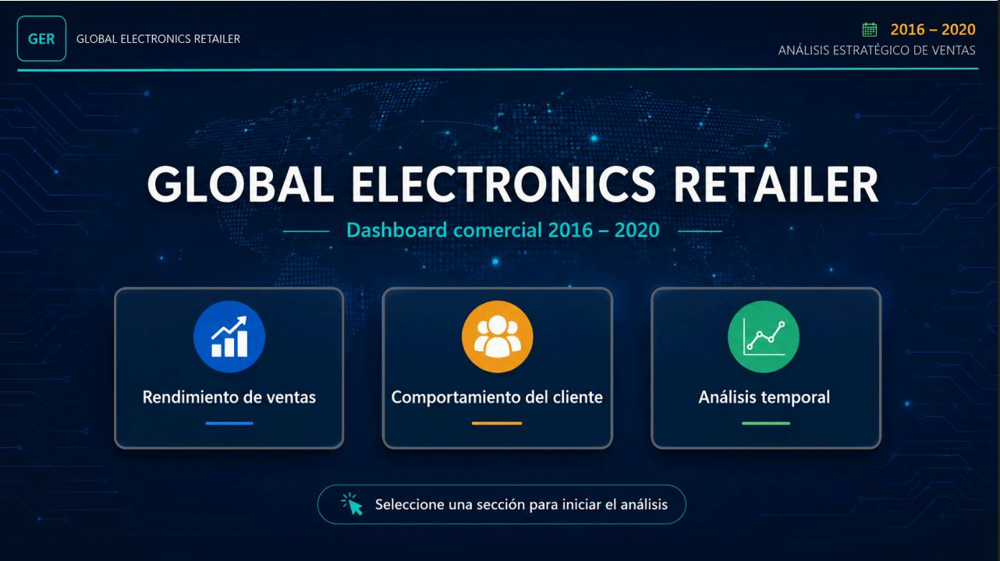
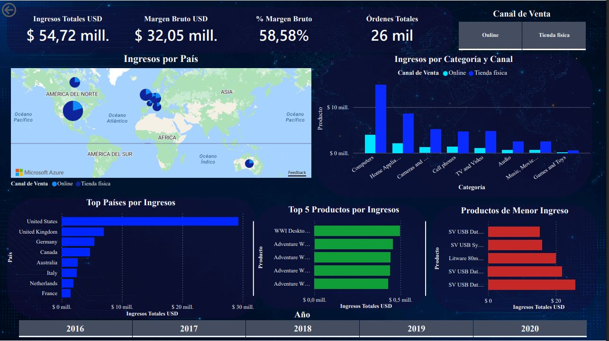
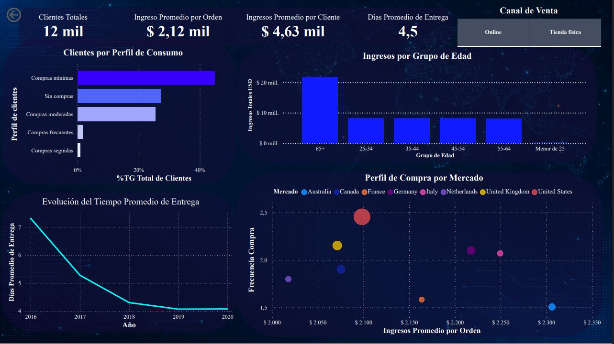
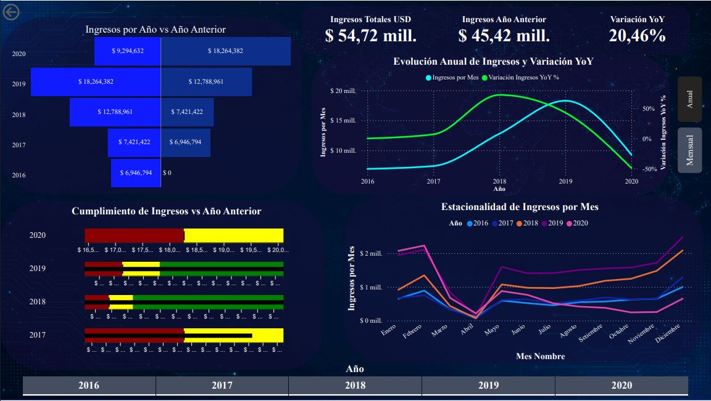

<h1 align="center">
📊 Global Electronics Retailer | Power BI Business Intelligence Dashboard
</h1>

<p align="center">
  
  
  
  
</p>

<p align="center">
  <a href="[AQUÍ_TU_ENLACE_POWER_BI_SERVICE](https://app.powerbi.com/links/gwxkKyXe7i?ctid=ef18f8a5-d24a-4133-8b55-29106fa5b772&pbi_source=linkShare)">🌐 Live Dashboard</a> •
  <a href="Project_Documentation.pdf">📄 Report</a> •
  <a href="docs/data-dictionary.md">📖 Data Dictionary</a>
</p>

<p align="center">
End-to-end Business Intelligence solution developed in <b>Power BI</b> for a global consumer electronics retailer.
</p>

<p align="center">
The project transforms five years of raw transactional data into an interactive dashboard that supports strategic decision-making through sales analysis, customer behavior insights, and temporal performance evaluation.
</p>

<p align="center">
  
</p>

---

# 📌 Project Overview

This project demonstrates the complete Business Intelligence workflow, from raw data preparation to interactive dashboard development for executive decision-making.

- Data preparation using Power Query
- Relational data modeling
- DAX measure development
- Interactive dashboard design
- Business-oriented insights and recommendations

The dashboard answers key business questions regarding sales performance, customer behavior and revenue evolution across different countries and sales channels.

---

# 🗂 Dataset

**Case Study**

Global Electronics Retailer (Academic Business Case)

**Period**

2016 – 2020

**Countries**

- Australia
- Canada
- France
- Germany
- Italy
- Netherlands
- United Kingdom
- United States

**Sales Channels**

- Physical Stores
- Online

---

### Dataset Summary

- 5 years of historical data
- 8 countries
- 67 physical stores
- Online sales channel
- Multiple currencies

---

# 🗃 Data Model

The solution integrates multiple datasets into a unified Star Schema model.

| Table | Description |
|--------|-------------|
| Sales | Sales transactions |
| Customers | Customer demographic information |
| Products | Product catalog |
| Stores | Physical stores and online channel |
| Exchange Rates | Daily currency exchange rates |

---

# ⚙ Technical Implementation

## Data Preparation

- Data cleaning
- Data transformation
- Data integration
- Data type validation

Implemented using **Power Query**.

---

## Data Modeling

A complete Star Schema was developed including:

- Fact table
- Dimension tables
- Calendar table
- Correct relationship cardinality
- Filter propagation

---

## DAX Measures

The analytical model includes measures for:

- Revenue
- Gross Margin
- Gross Margin %
- Orders
- Average Ticket
- Customer Metrics
- Year-over-Year Growth
- Time Intelligence
- CALCULATE()
- Dynamic KPIs

---

# ✨ Key Features

- End-to-end Business Intelligence solution in Power BI.
- Interactive navigation using buttons and bookmarks for an intuitive user experience.
- Star schema data model.
- Data transformation with Power Query.
- Custom DAX measures and time intelligence.
- Executive dashboard with slicers, bookmarks and interactive navigation.
- Business-oriented insights for strategic decision-making.

---

# 📈 Dashboard Sections

## 📊 Sales Performance



Executive overview of sales performance across products, countries and sales channels.

---

## 👥 Customer Behavior



Analyze customer purchasing patterns, segmentation, average order value and delivery performance across different markets.

---

## 📅 Temporal Analysis



Evaluate revenue growth, Year-over-Year performance and seasonal trends to support strategic business decisions.

---

# 💡 Business Questions Answered

The dashboard was designed to support data-driven decision-making by answering questions such as:

- Which countries generate the highest revenue?
- Which product categories perform best?
- How does the online channel compare with physical stores?
- How have sales evolved over time?
- Which customer segments are most valuable?
- Are there seasonal sales patterns?

---

# 🛠 Technologies Used

- Power BI Desktop
- Power Query
- DAX
- Power BI Service
- Git
- GitHub

---

# 📂 Repository Structure

```
Global-Electronics-Retailer-PowerBI/
│
├── README.md
├── Global_Electronics_Retailer_PowerBI.pbix
├── Project_Documentation.pdf
│
├── docs/
│   └── data-dictionary.md
│
└── images/
    ├── dashboard-preview.png
    ├── sales-performance.png
    ├── customer-behavior.png
    └── temporal-analysis.png
```

---

# 🌐 Live Dashboard

Explore the interactive dashboard published on Power BI Service:

🔗 https://app.powerbi.com/links/gwxkKyXe7i?ctid=ef18f8a5-d24a-4133-8b55-29106fa5b772&pbi_source=linkShare

---

# 📚 Documentation

Additional project documentation:

- 📖 [Data Dictionary](docs/data-dictionary.md)
- 📄 [Project Documentation](Project_Documentation.pdf)

---

# 📚 Learning Outcomes

During this project I strengthened practical skills in:

- Data preparation with Power Query
- Dimensional modeling
- DAX development
- Interactive dashboard design
- Business storytelling
- Executive reporting
- Data-driven decision making

---

# 👨‍💻 Author

**Jherson Paredes Cuba**

Industrial and Systems Engineering Student

Data Analytics & Business Intelligence Enthusiast

---
